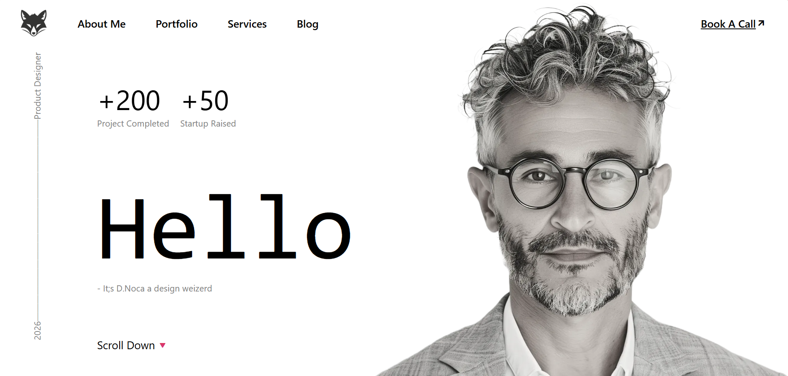

# Designer Landing Page - My First React Project

A minimalist, modern landing page for a product designer, built as my first exploration into the React ecosystem.


## 🚀 Project Overview

This project was created to understand the fundamentals of React without the abstraction of JSX. It uses `React.createElement` to programmatically build the DOM structure, mimicking how React works under the hood.

## 🛠️ Tech Stack

- **React 18**: Utilizing the CDN version for a lightweight setup.
- **Sass (SCSS)**: For structured, maintainable styling using mixins and nesting.
- **Remix Icon**: For high-quality vector icons.
- **Vanilla JavaScript**: To handle the rendering logic.

## ✨ Key Features

- **Component-based structure**: Built using nested React elements.
- **Dynamic Layout**: A responsive-ready design featuring a vertical side-label and a hero section.
- **Modern UI**: Clean typography and a sleek background-integrated design.

## 📁 File Structure

- `index.html`: The entry point, loading React via CDN.
- `script.js`: Contains the React logic and element creation.
- `style.scss`: The source styling file with custom variables and mixins.
- `style.css`: The compiled CSS used in the browser.

## ⚙️ How to Run

1. Clone the repository:
   ```bash
   git clone https://github.com/your-username/your-repo-name.git
   ```
2. Open `index.html` directly in your browser, or use a "Live Server" extension in VS Code for the best experience.

## 💡 What I Learned

- How `React.createElement` maps to the Virtual DOM.
- Integrating React into a project via CDN without a complex build tool like Webpack or Vite.
- Managing layouts with SCSS mixins and absolute positioning in a React context.

---

_Created with ❤️ as my first step into React development._
